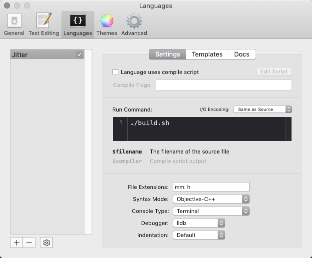

# jit.fx

Live coding with [Jitter](https://cycling74.com/) + [CodeRunner](https://coderunnerapp.com/).

<blockquote class="twitter-tweet">
Live coding with Jitter + CodeRunner. <a href="https://t.co/IC2ZYBMlu7">pic.twitter.com/IC2ZYBMlu7</a>
&mdash; mizt (@mizt_org) <a href="https://twitter.com/mizt_org/status/1170305339964575744?ref_src=twsrc%5Etfw">September 7, 2019</a></blockquote> 

### plug-in 

Open `/Users/mizt/Development/jit.fx/jit.fx.mxo/Contents/Resources/FX/FX.mm`.  
Edit code and build.  
Auto-reload on build success.

### CodeRunner settings

